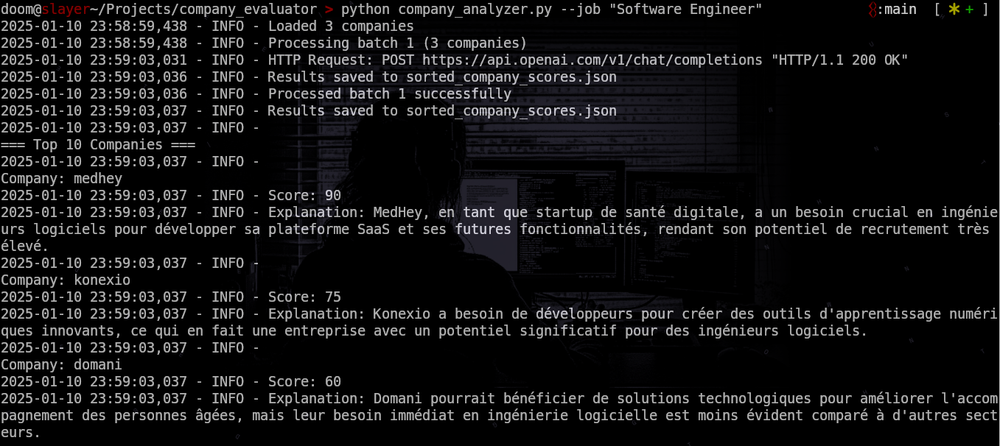

# AI-Powered Company Match Finder 🎯

Find your perfect company match among French startups using AI! This tool analyzes company descriptions and ranks them based on their potential fit with your desired role.

## 🌟 Features
- Pre-loaded with data from 1158 French startups from FStation
- AI-powered analysis of company missions and values
- Customizable scoring based on your job preferences
- Outputs both detailed explanations and numerical scores
- Supports batch processing to handle large datasets efficiently
- Multiple output formats (JSON/CSV)

## 🖼️ Example Output


## 🚀 Quick Start

1. Clone the repository
```bash
git clone [repository-url]
cd company-match-finder
```

2. Create a `.env` file with your OpenAI API key:
```
OPENAI_API_KEY=your-openai-key-here
```

3. Install requirements:
```bash
pip install -r requirements.txt
```

4. Run the script:
```bash
python main.py --job "Senior DevOps Engineer"
```

## 💡 Customization

### Modifying the Prompt
The default prompt evaluates companies based on their mission and potential need for your role. Feel free to modify the prompt in `main.py` to better suit your needs! Some ideas:

- Focus on specific technologies or skills
- Evaluate company culture fit
- Look for specific industries or domains
- Analyze growth potential
- Consider remote work policies

### Command Line Options
```bash
# Basic usage
python main.py --job "Frontend Developer"

# Change batch size
python main.py --job "Data Scientist" --batch-size 20

# Output as CSV
python main.py --job "Product Manager" --output-format csv

# Use a different GPT model
python main.py --job "Software Engineer" --model gpt-4
```

## 📊 Output
The script generates:
- A JSON/CSV file with detailed company analyses
- Console output showing the top 10 matches
- Processing logs with cost estimates

## ⚠️ Note
- The script uses the OpenAI API which has associated costs
- Built-in rate limiting helps prevent excessive API usage
- Cost estimates are logged during execution

## 📄 License
MIT License

## 🤝 Contributing
Feel free to:
- Submit issues
- Propose improvements
- Add more company data
- Share your custom prompts that worked well!

## 🙏 Acknowledgments
- Data sourced from FStation's startup database
- Powered by OpenAI's GPT models

Happy job hunting! 🎉
